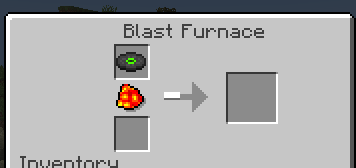
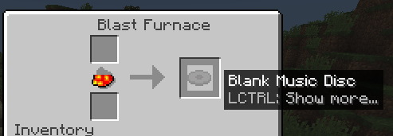
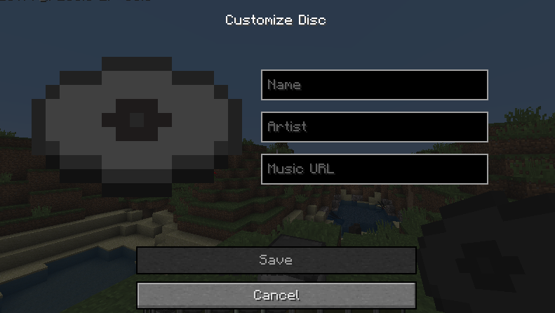
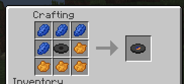
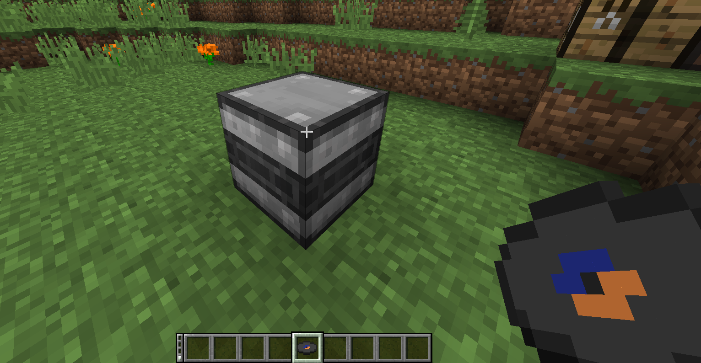
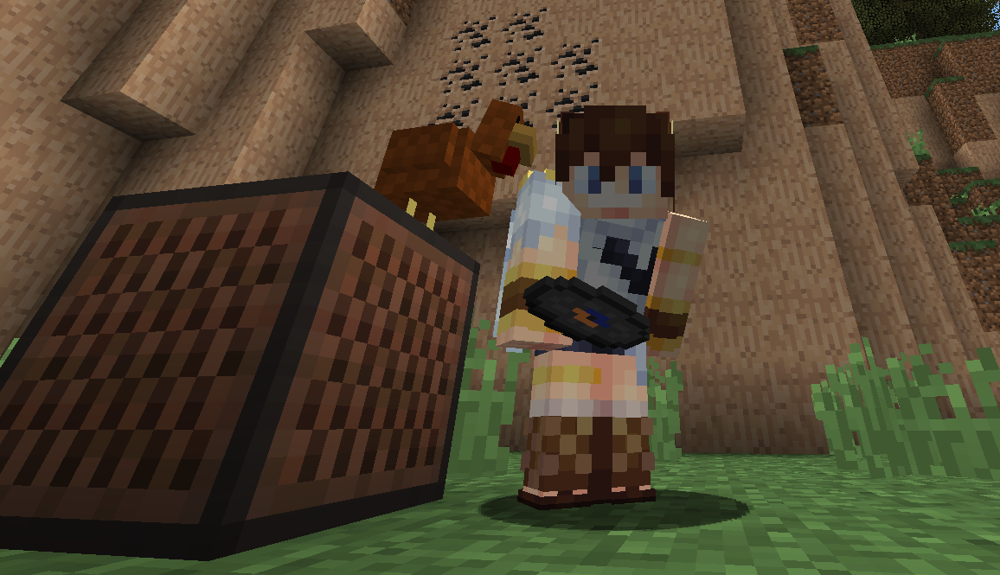

# Vinyl

Custom music discs for Better than Adventure!

## IMPORTANT NOTES
- This mod uses [`yt-dlp`](https://github.com/yt-dlp/yt-dlp) to download audio!
  - If you're on singleplayer, **you must have `yt-dlp` installed to use Vinyl.**
  - If you're running a server with Vinyl, **you must have `yt-dlp` installed on the server**, but it is **not** required for connecting clients.
- When used on a server, **Vinyl will send audio files from server to client**.
  - If you trust the server host this should be completely fine. If not, this is something you should at least be aware of before you use Vinyl.

## How to use
1. Put any music disc in a Blast Furnace to get a blank disc.
   
   
2. Right click with the disc in hand to set the name, artist, and URL to download from.
   
3. Add dye to colour the disc! (only one pattern supported at the moment, but I may add more)
   
4. Right click a Vinyl Press whilst holding the disc. When it's done pressing, right click again to take it out.
   
5. Enjoy your new custom music disc in a Jukebox! You can also use it as a Note Block sound by putting the disc in a chest
   underneath the Note Block!
   
